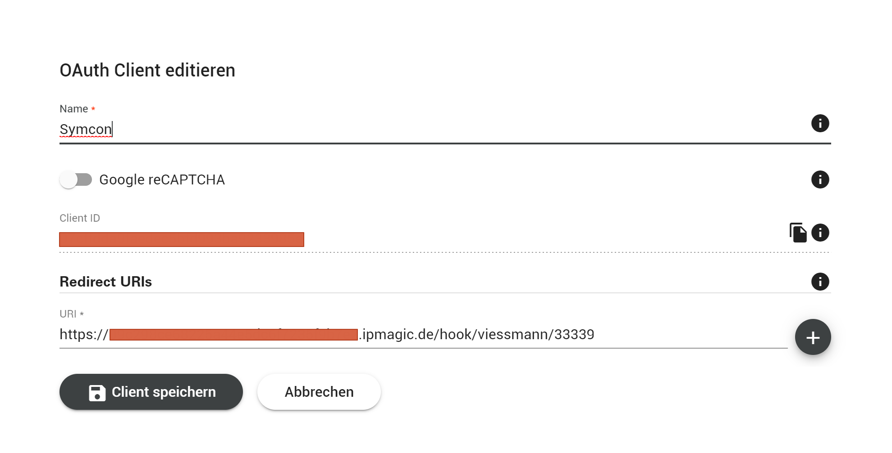

# VitoConnect
Das Modul dient dazu die VitoConnect Cloud-API abzufragen und alle relevanten Informationen über das angeschlossene Viessmann Gerät darzustellen.

### Inhaltsverzeichnis

1. [Funktionsumfang](#1-funktionsumfang)
2. [Voraussetzungen](#2-voraussetzungen)
3. [Software-Installation](#3-software-installation)
4. [Einrichten der Instanzen in IP-Symcon](#4-einrichten-der-instanzen-in-ip-symcon)
5. [Statusvariablen und Profile](#5-statusvariablen-und-profile)
6. [WebFront](#6-webfront)
7. [PHP-Befehlsreferenz](#7-php-befehlsreferenz)

### 1. Funktionsumfang

* Abfrage der Daten, welche über die Cloud-API verfügbar sind
* Ändern von Werten (aktuell nur die Ziel-Temperaturen)

### 2. Voraussetzungen

- IP-Symcon ab Version 5.1

### 3. Software-Installation

* Über den Module Store das Modul Viessmann Vitoconnect installieren.
* Alternativ über das Module Control folgende URL hinzufügen:  
`https://github.com/paresy/Viessmann`  

### 4. Einrichten der Instanzen in IP-Symcon

- Unter "Instanz hinzufügen" ist das 'VitoConnect'-Modul unter dem Hersteller 'Viessmann' aufgeführt. Zusätzlich muss eine ClientID über das Developer Portal von Viessmann beantragt werden. Dies ist unter https://developer.viessmann.com/ im Menüpunkt "My Dashbaord" zu finden. Beim erstellen des Clients darf der Name frei gewählt werden - bei der Redirect URI muss die ipmagic.de Adresse eingegeben werden, welche in der VitoConnect Instanz angezeigt wird. Zur Verknüpfung innerhalb der VitoConnect Instanz wird ein aktivierter Symcon Connect benötigt. 

__Konfigurationsseite__:

Name            | Beschreibung
--------------- | ---------------------------------
ClientID        | ClientID, welche über https://developer.viessmann.com/ beantragt wurde
Intervall       | Abfrageintervall in Minuten

### 5. Statusvariablen und Profile

Es werden diverse zusätzliche Statusvariablen und Profile erstellt.
Diese sind je nach angeschlossenem Gerät unterschiedlich.

### 6. WebFront

Im WebFront werden alle Variablen angezeigt. Einige sind ggf. schaltbar.

### 7. PHP-Befehlsreferenz

Es stehen keine weiteren Befehle zur Verfügung. 
